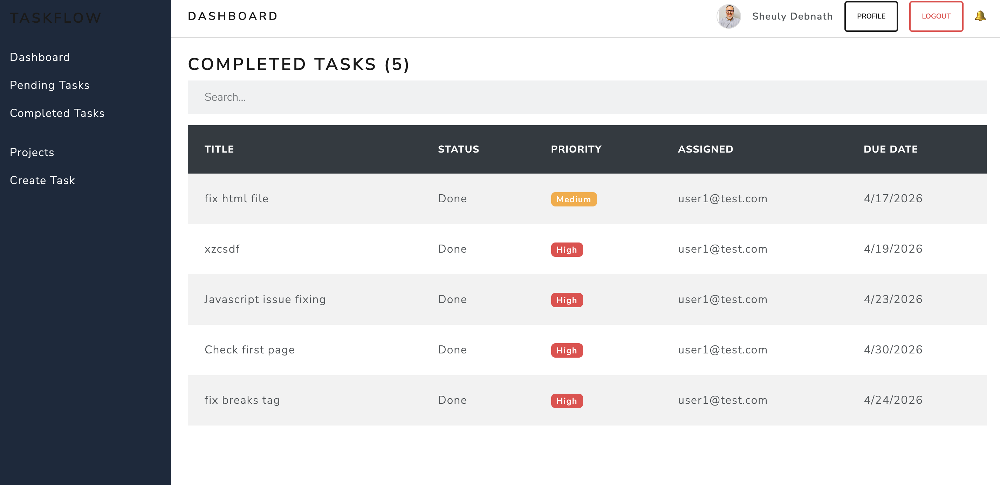
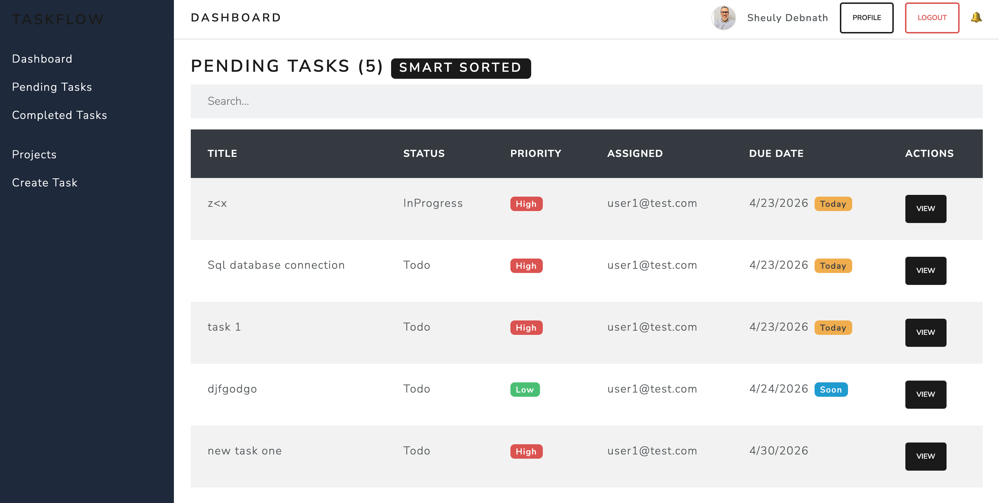
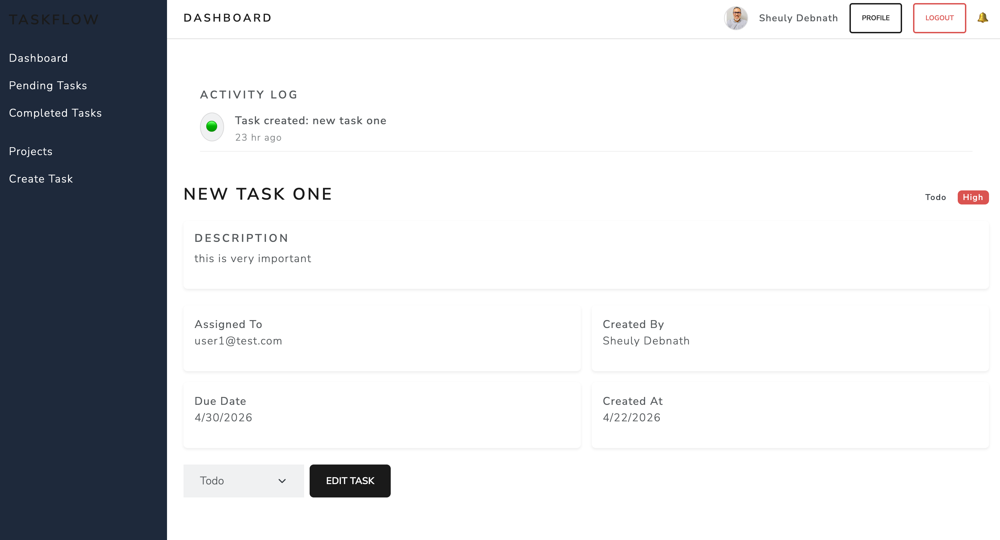
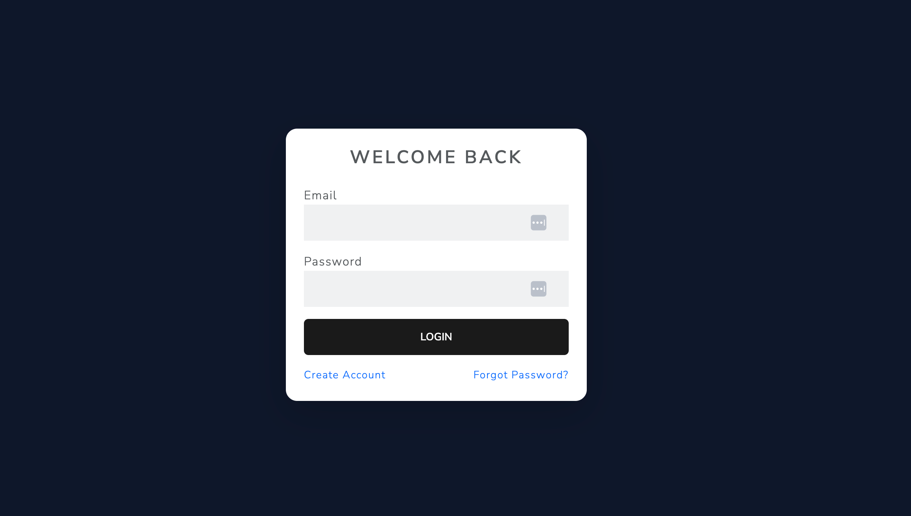
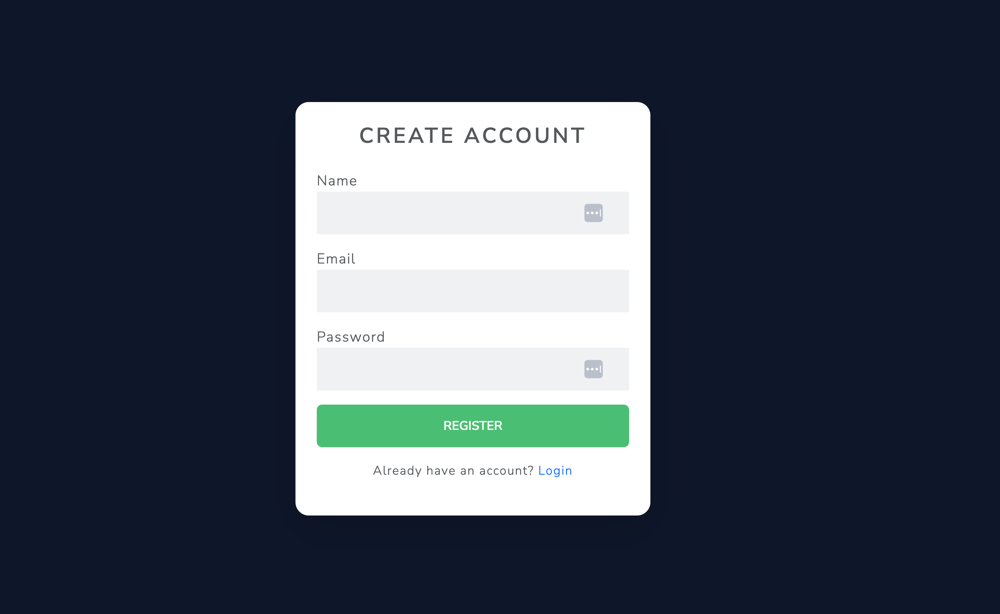
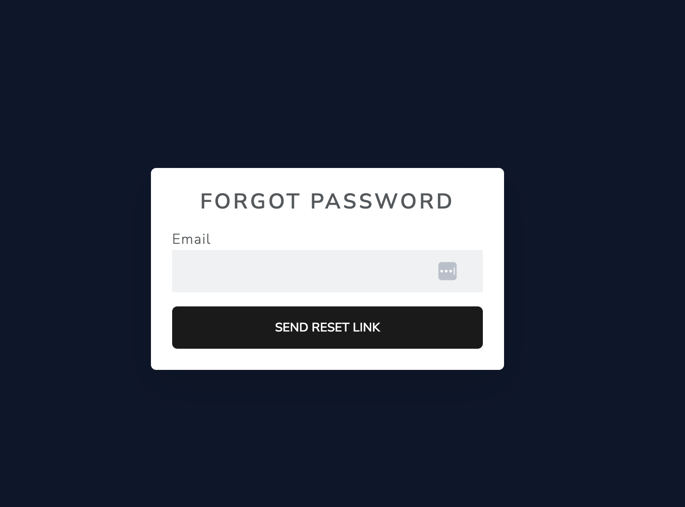

#  Task Management System

A full-stack task management application built with **ASP.NET Core Web API** and **React (TypeScript)**.
Designed using clean architecture principles with secure authentication, real-time-like notifications, and activity tracking.

---

##  Features

###  Authentication & Security

* JWT-based authentication
* Role-based access control (Admin, Manager, User)
* Secure Forgot & Reset Password flow (token-based)

###  Task Management

* Create, update, tasks
* Assign tasks to users
* Status tracking (Todo, In Progress, Done)
* Priority levels (Low, Medium, High)
* Concurrency handling with RowVersion

###  Dashboard

* Kanban board (Todo, In Progress, Done)
* Analytics:

  * Total tasks
  * Completed tasks
  * Overdue tasks
  * Completion rate
* Most urgent task detection

###  Notification System

* Notification when task is assigned
* Unread notification badge
* Mark as read on click
* Auto-refresh (polling every 5 seconds)

###  Activity Log

* Tracks task history:

  * Task created
  * Task updated
  * Status changes
* Timestamped audit trail

###  User Profile

* Update name and email
* Profile image upload
* Persistent user data

---

##  Architecture

Backend follows **Clean Architecture**:

* **Domain** → Entities and core models
* **Application** → Business logic and interfaces
* **Infrastructure** → Database and repositories
* **API** → Controllers and endpoints

---

##  Tech Stack

### Backend

* ASP.NET Core Web API (.NET 8)
* Entity Framework Core
* SQL Server (Docker)
* JWT Authentication

### Frontend

* React (TypeScript)
* Axios
* Bootstrap

### DevOps / Tools

* Docker (SQL Server container)
* Git & GitHub

---

## 🐳 Database (SQL Server via Docker)

Make sure SQL Server container is running:

```bash
docker run -e "ACCEPT_EULA=Y" -e "SA_PASSWORD=YourPassword123!" \
-p 1433:1433 --name sqlserver \
-d mcr.microsoft.com/mssql/server:2022-latest
```

---

### 🔗 Connection String

Update the `ConnectionStrings` in `appsettings.json`:

```json
{
  "ConnectionStrings": {
    "DefaultConnection": "Server=localhost,1433;Database=TaskDb;User Id=sa;Password=YourPassword123!;TrustServerCertificate=True"
  }
}
```

---

##  Setup Instructions

###  Backend
## Backend (.NET API)
Run from the root folder:

dotnet restore 

dotnet ef database update \
--project TaskManagementSystem.Infrastructure \
--startup-project TaskManagementSystem.API

dotnet run --project TaskManagementSystem.API

---

###  Frontend (React)

cd task-ui
npm install
npm run dev

---

##  Demo Credentials

**Admin**

* Email: [admin@test.com](mailto:admin@test.com)
* Password: 123456

---

##  Screenshots

### Dashboard


### Task Details (Activity Log)





### Notifications


### Profile


### Login




---

##  Key Highlights

* Clean architecture implementation
* Secure authentication and password reset flow
* Notification system with unread tracking
* Activity logging for auditability
* Optimistic UI updates
* Full-stack integration (API + React)
* Docker-based SQL Server setup

---

##  What I Learned

* Designing scalable backend architecture in ASP.NET Core
* Implementing secure authentication with JWT
* Managing relational data using Entity Framework
* Building a responsive frontend using React
* Handling real-world features like notifications and activity logs
* Using Docker for database setup and environment consistency

---

##  Future Improvements

* Real-time notifications using SignalR
* Drag & drop Kanban board
* Email integration for password reset
* Advanced analytics dashboard
* Mobile responsiveness improvements

---

##  Author

Sheuly Debnath
MSc in Electronics, Informatics and Technology  
University of Oslo  

Full-Stack Developer (.NET, React, SQL Server, Docker)

##  Contact

- LinkedIn: https://www.linkedin.com/in/sheulydebanth/
- Email: sheulycse.mbstu@gmail.com
