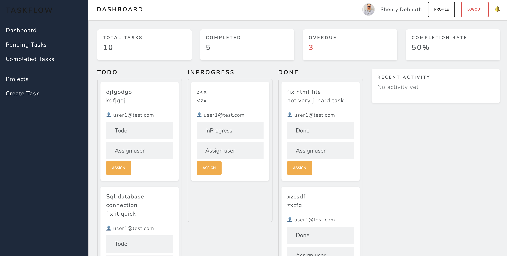
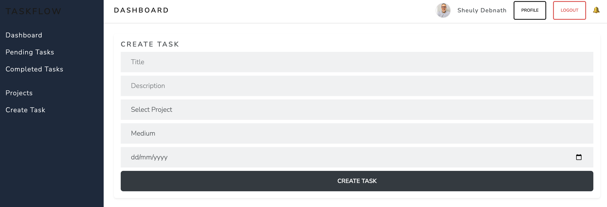
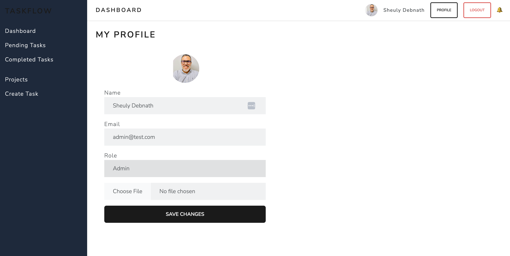

# Workflow Management Platform

A full-stack workflow management platform built using ASP.NET Core Web API and React. The application was designed to simulate real-world business workflows with focus on scalable backend architecture, structured domain separation, authentication and authorization, activity tracking, and maintainable full-stack development practices.

---

## Overview

The platform supports task assignment, workflow tracking, role-based access control, notifications, audit logging, and dashboard analytics within a structured multi-layered architecture.

The project follows Clean Architecture principles to maintain clear separation between business logic, application services, infrastructure concerns, and API boundaries.

---

## Core Features

### Authentication & Authorization
- JWT-based authentication
- Role-based authorization (Admin, Manager, User)
- Secure password reset workflow
- Protected API endpoints and token validation

### Workflow Management
- Task creation, updates, and assignment
- Workflow status tracking
- Priority management
- Activity history and audit logging
- Optimistic concurrency handling using RowVersion

### Dashboard & Analytics
- Kanban-style workflow visualization
- Task completion metrics
- Overdue task monitoring
- Priority-based workflow insights

### Notifications
- Task assignment notifications
- Unread notification tracking
- Polling-based near real-time updates

### User Management
- Profile management
- User image upload
- Persistent account settings

---

## System Architecture

The backend follows a layered Clean Architecture approach:

### Domain Layer
Core entities and domain models

### Application Layer
Business rules, interfaces, and use cases

### Infrastructure Layer
Database access, repositories, and external integrations

### API Layer
RESTful API endpoints and request handling

---

## Technology Stack

### Backend
- ASP.NET Core Web API (.NET 8)
- Entity Framework Core
- SQL Server
- Azure SQL Database
- JWT Authentication

### Frontend
- React
- TypeScript
- Axios

### Development & Tooling
- Docker
- Git & GitHub

---

## Technical Focus Areas

- RESTful API design
- Clean Architecture implementation
- Authentication and authorization
- Database design and relational data management
- Structured backend layering
- Workflow-oriented business logic
- Maintainable and extensible application structure
- Performance-focused backend development
- Full-stack integration between API and frontend

---

## Database Setup

The project supports both local SQL Server development using Docker and cloud-based persistence using Azure SQL Database.
For local development, SQL Server can be started using the following Docker container:

```bash
docker run -e "ACCEPT_EULA=Y" -e "SA_PASSWORD=YourPassword123!" \
-p 1433:1433 --name sqlserver \
-d mcr.microsoft.com/mssql/server:2022-latest

```


###  Connection String

Update the database connection string in appsettings.json:

{
  "ConnectionStrings": {
    "DefaultConnection": "Server=localhost,1433;Database=TaskDb;User Id=sa;Password=YourPassword123!;TrustServerCertificate=True"
  }
}

##  Running the Application

###  Backend

Run from the root folder:

dotnet restore 

dotnet ef database update \
--project TaskManagementSystem.Infrastructure \
--startup-project TaskManagementSystem.API
dotnet run --project TaskManagementSystem.API


###  Frontend

cd task-ui
npm install
npm run dev


##  Demo Credentials

**Admin**

* Email: [admin@test.com](mailto:admin@test.com)
* Password: 123456


##  Screenshots

### Dashboard


### Task Details (Activity Log)

### Tasks


### Create Task


### Profile


### Login


##  Future Improvements

* SignalR-based real-time notifications
* Drag-and-drop Kanban interactions
* Email integration workflows
* Expanded analytics and reporting
* Improved mobile responsiveness
* CI/CD deployment pipeline integration


##  Author

Sheuly Debnath
MSc in Electronics, Informatics and Technology  
University of Oslo  


##  Contact

- LinkedIn: [https://www.linkedin.com/in/sheulydebanth/](https://www.linkedin.com/in/debnathsheuly/)
- Email: sheulycse.mbstu@gmail.com
